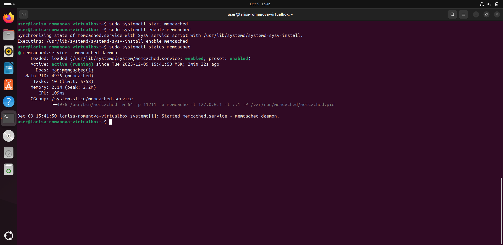
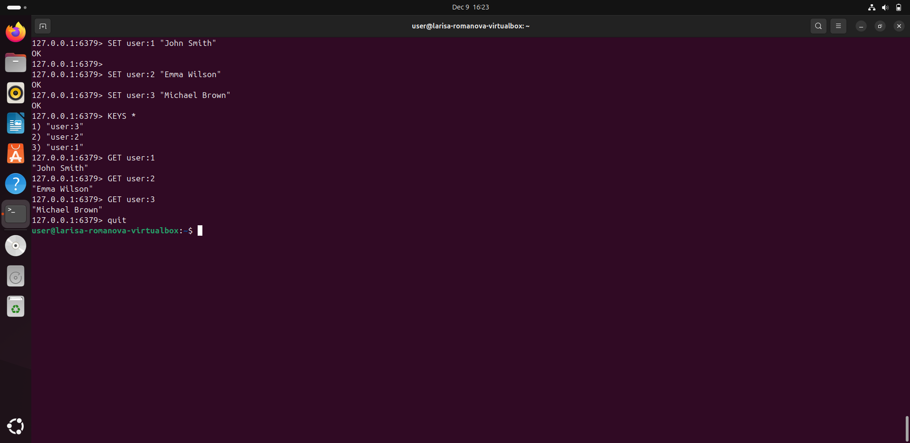

# Кеширование - Домашнее задание
## Романова Лариса

---

## Задание 1. Кеширование
**Примеры проблем, которые может решить кеширование:**

1. **Высокая нагрузка на базу данных** - кеширование часто запрашиваемых данных снижает количество обращений к БД.
2. **Медленная обработка сложных вычислений** - кеширование результатов ресурсоёмких операций.
3. **Долгий доступ к внешним API** - кеширование ответов сторонних сервисов.
4. **Повышение отзывчивости веб-приложений** - кеширование статики на CDN.
5. **Сглаживание пиковых нагрузок** - кеш отдаёт данные без обращения к основным системам.
6. **Уменьшение сетевой задержки** - распределённое кеширование ближе к пользователям.
7. **Повторяющиеся запросы одинаковых данных** - устранение дублирования операций.
8. **Повышение доступности при сбоях** - кеш может временно отдавать устаревшие данные.
9. **Снижение затрат на инфраструктуру** - уменьшение нагрузки на оборудование.
10. **Оптимизация работы дисковых систем** - кеширование в оперативной памяти.

---

## Задание 2. Memcached
**Установка и запуск memcached**

Установлен и запущен memcached на Ubuntu в Oracle Virtual Box.

---

## Задание 3. Удаление по TTL в Memcached
**Запись ключей с TTL 5 секунд**

Выполнено подключение к memcached через telnet и запись ключей с TTL 5 секунд.

---

## Задание 4. Запись данных в Redis
**Запись и чтение ключей из Redis**

Установлен Redis, записаны ключи с английскими значениями.

